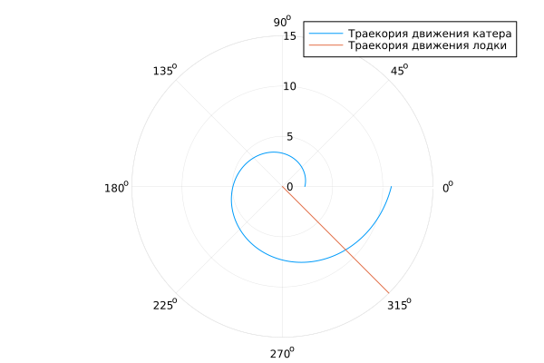

---
## Front matter
lang: ru-RU
title: Лаьораторная работа №2
subtitle: Задача о погоне
author:
  - Беличева Д. М.
institute:
  - Российский университет дружбы народов, Москва, Россия
## i18n babel
babel-lang: russian
babel-otherlangs: english

## Formatting pdf
toc: false
toc-title: Содержание
slide_level: 2
aspectratio: 169
section-titles: true
theme: metropolis
header-includes:
 - \metroset{progressbar=frametitle,sectionpage=progressbar,numbering=fraction}
 - '\makeatletter'
 - '\beamer@ignorenonframefalse'
 - '\makeatother'
---

# Информация

## Докладчик

:::::::::::::: {.columns align=center}
::: {.column width="70%"}

  * Беличева Дарья Михайловна
  * студентка
  * Российский университет дружбы народов
  * [1032216453@pfur.ru](mailto:1032216453@pfur.ru)
  * <https://dmbelicheva.github.io/ru/>

:::
::: {.column width="25%"}


:::
::::::::::::::

## Цель работы

Построить математическую модель для выбора правильной стратегии при решении примера задаче о погоне.

## Задание

На море в тумане катер береговой охраны преследует лодку браконьеров.
Через определенный промежуток времени туман рассеивается, и лодка обнаруживается на расстоянии 11,4 км от катера. Затем лодка снова скрывается в тумане и уходит прямолинейно в неизвестном направлении. Известно, что скорость катера в 4,1 раза больше скорости браконьерской лодки.

## Задание

1. Записать уравнение, описывающее движение катера, с начальными условиями для двух случаев (в зависимости от расположения катера относительно лодки в начальный момент времени).

2. Построить траекторию движения катера и лодки для двух случаев.

3. Найти точку пересечения траектории катера и лодки 

## Выполнение лабораторной работы

Формула для выбора варианта: `(1032216453%70)+1` = 24 вариант.

## Выполнение лабораторной работы

$$
\dfrac{x}{v} = \dfrac{k-x}{4.1v} \text{ -- в первом случае}
$$
$$
\dfrac{x}{v} = \dfrac{k+x}{4.1v} \text{ -- во втором}
$$

Отсюда мы найдем два значения $x_1 = \dfrac{11.4}{5,1}$ и $x_2 = \dfrac{11.4}{3,1}$, задачу будем решать для двух случаев.

## Выполнение лабораторной работы

$$v_{\tau} = \sqrt{16.81v^2-v^2} = \sqrt{15.81}v$$

Из чего можно вывести:

$$
r\dfrac{d \theta}{dt} = \sqrt{15.81}v
$$

## Выполнение лабораторной работы

Решение исходной задачи сводится к решению системы из двух дифференциальных уравнений:

$$\begin{cases}
&\dfrac{dr}{dt} = v\\
&r\dfrac{d \theta}{dt} = \sqrt{15.81}v
\end{cases}$$

## Выполнение лабораторной работы

С начальными условиями для первого случая:

$$\begin{cases}
&{\theta}_0 = 0\\  \tag{1}
&r_0 = \dfrac{11.4}{5.1}
\end{cases}$$

## Выполнение лабораторной работы

Или для второго:

$$\begin{cases}
&{\theta}_0 = -\pi\\  \tag{2}
&r_0 = \dfrac{11.4}{3.1}
\end{cases}$$

## Выполнение лабораторной работы

Исключая из полученной системы производную по $t$, можно перейти к следующему уравнению:

$$
\dfrac{dr}{d \theta} = \dfrac{r}{\sqrt{15.81}}
$$

## Построение модели

```Julia
# расстояние от лодки до катера
k = 11.4 
# начальные условия для 1 и 2 случаев
r0 = k/5.1 
r0_2 = k/3.1 
theta0 = (0.0, 2*pi) 
theta0_2 = (-pi, pi)
# данные для движения лодки браконьеров
fi = 3*pi/4;
t = (0, 50);
```
## Построение модели

```Julia
# функция, описывающая движение лодки браконьеров
x(t) = tan(fi)*t;
# функция, описывающая движение катера береговой охраны
f(r, p, t) = r/sqrt(15.81)
```

## Построение модели

```Julia
# постановка проблемы и решение ДУ для 1 случая

prob = ODEProblem(f, r0, theta0)

sol = solve(prob, saveat = 0.01)

# отрисовка траектории движения катера

plot(sol.t, sol.u, proj=:polar, lims=(0, 15), label = "Траекория движения катера")
```

## Построение модели

{#fig:001 width=70%}

## Построение модели

```Julia

## необходимые действия для построения траектории движения лодки
ugol = [fi for i in range(0,15)]
x_lims = [x(i) for i in range(0,15)]
# отрисовка траектории движения лодки вместе с катером
plot!(ugol, x_lims, proj=:polar, lims=(0, 15), label = "Траекория движения лодки")
```

## Построение модели

{#fig:002 width=70%}

## Построение модели

```Julia
# точное решение ДУ, описывающего движение катера береговой охраны
y(x)=(1140*exp(10*x)/(sqrt(1581)))/(509)
# подставим в точное решение угол, под которым движется 
#лодка браконьеров для нахождения точки пересечения
y(fi)
# точка пересечения лодки и катера для 1 случая
9.628170843477646e8
```

## Построение модели в случае 2

```Julia
# постановка проблемы и решение ДУ для 2 случая
prob_2 = ODEProblem(f, r0_2, theta0_2)
sol_2 = solve(prob_2, saveat = 0.01)
# отрисовка траектории движения катера
plot(sol_2.t, sol_2.u, proj=:polar, lims=(0,15), label = "Траекория движения катера")
```

## Построение модели в случае 2

{#fig:003 width=70%}

## Построение модели в случае 2

```Julia
# отрисовка траектории движения лодки вместе с катером
plot!(ugol, x_lims, proj=:polar, lims=(0, 15), label = "Траекория движения лодки")
```

## Построение модели в случае 2

{#fig:004 width=70%}

## Построение модели в случае 2

```Julia
# точное решение ДУ, описывающего движение катера береговой охраны для 2 случая
y2(x)=(114*exp((10*x/sqrt(1581))+(10*pi/sqrt(1581))))/(31)
# подставим в точное решение угол, под которым движется лодка браконьеров для нахождения точки пересечения
y2(fi-pi)
# точка пересечения лодки и катера для 2 случая
6.651143558300665
```

## Выводы

В процессе выполнения данной лабораторной работы я построила математическую модель для выбора правильной стратегии при решении примера задаче о погоне.

## Список литературы

1. Кривая погони [Электронный ресурс]. URL: https://ru.wikipedia.org/wiki/Кривая_погони.
