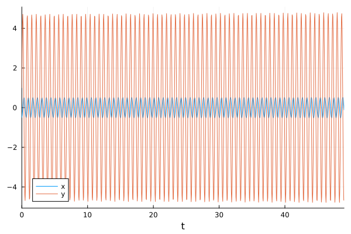
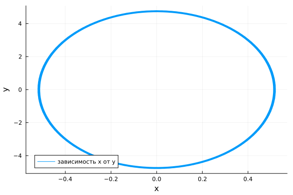
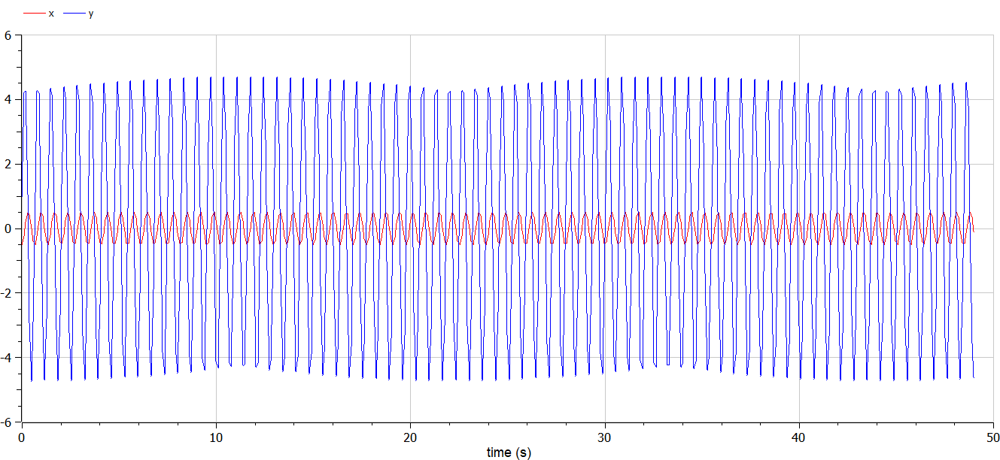
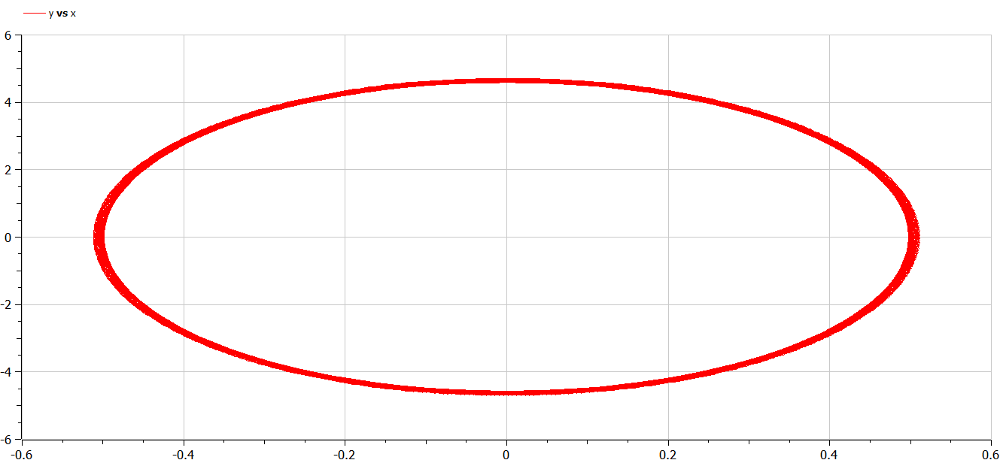
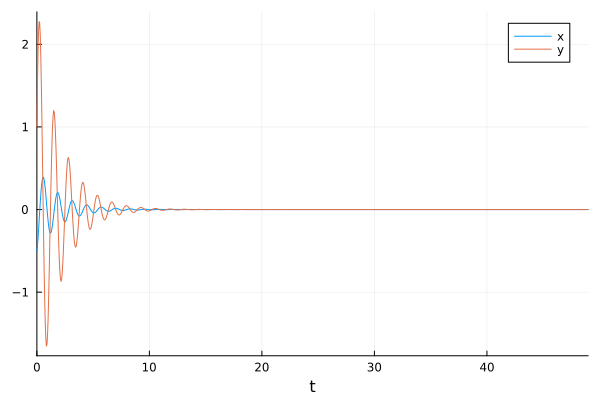
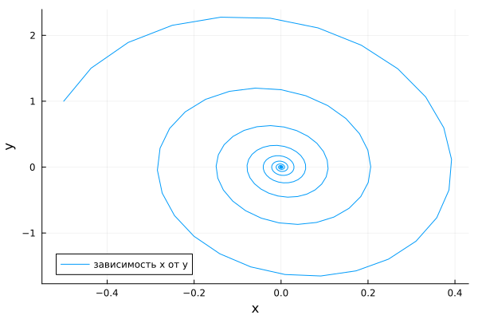
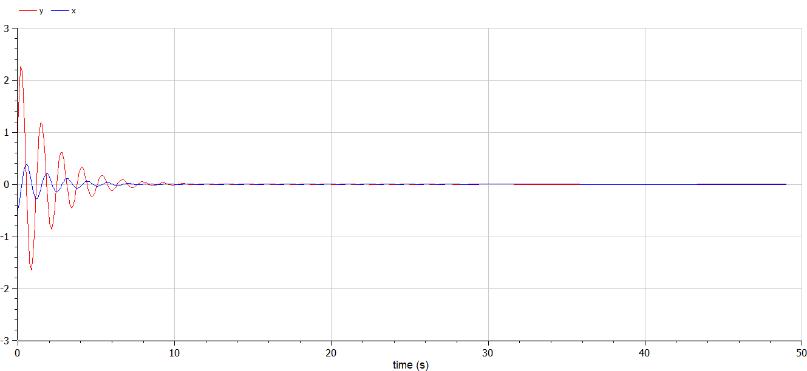
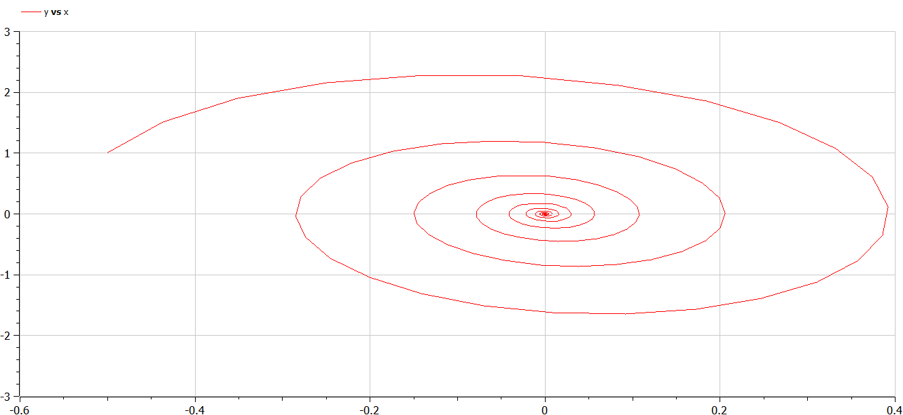
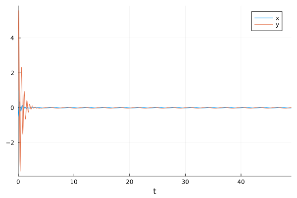
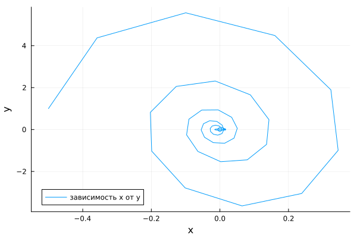

---
## Front matter
lang: ru-RU
title: Лабораторная работа №4
subtitle: Модель гармонических колебаний
author:
  - Беличева Д. М.
institute:
  - Российский университет дружбы народов, Москва, Россия

## i18n babel
babel-lang: russian
babel-otherlangs: english

## Formatting pdf
toc: false
toc-title: Содержание
slide_level: 2
aspectratio: 169
section-titles: true
theme: metropolis
header-includes:
 - \metroset{progressbar=frametitle,sectionpage=progressbar,numbering=fraction}
 - '\makeatletter'
 - '\beamer@ignorenonframefalse'
 - '\makeatother'
---

# Информация

## Докладчик

:::::::::::::: {.columns align=center}
::: {.column width="70%"}

  * Беличева Дарья Михайловна
  * студентка
  * Российский университет дружбы народов
  * [1032216453@pfur.ru](mailto:1032216453@pfur.ru)
  * <https://dmbelicheva.github.io/ru/>

:::
::: {.column width="25%"}


:::
::::::::::::::

## Цель работы

Построить математическую модель гармонического осциллятора.

## Задание

Построить фазовый портрет гармонического осциллятора и решение уравнения
гармонического осциллятора для следующих случаев:

1. Колебания гармонического осциллятора без затуханий и без действий внешней
силы $\ddot{x} +9.2x = 0,$

2. Колебания гармонического осциллятора c затуханием и без действий внешней силы $\ddot x + \dot x + 4.9 x = 0,$

3. Колебания гармонического осциллятора c затуханием и под действием внешней силы $\ddot x + 3.5 \dot x + 13 x = 2.5 cos(2t).$
На интервале $t \in [0; 49]$ (шаг 0.05) с начальными условиями $x_0 = -0.5, \,\, y_0=1.$

# Выполнение лабораторной работы

## Модель колебаний гармонического осциллятора без затуханий и без действий внешней силы

```Julia

# Используемые библиотеки
using DifferentialEquations, Plots;

# Начальные условия
tspan = (0,49)
u0 = [-0.5, 1]
p1 = [0, 9.2]
```

## Модель колебаний гармонического осциллятора без затуханий и без действий внешней силы

```Julia
# Задание функции
function f1(u, p, t)
    x, y = u
    g, w = p
    dx = y
    dy = -g .*y - w^2 .*x
    return [dx, dy]
end
# Постановка проблемы и ее решение
problem1 = ODEProblem(f1, u0, tspan, p1)
sol1 = solve(problem1, Tsit5(), saveat = 0.05)
```

## Модель колебаний гармонического осциллятора без затуханий и без действий внешней силы

{#fig:001 width=65%}

## Модель колебаний гармонического осциллятора без затуханий и без действий внешней силы

{#fig:002 width=65%}

## Модель колебаний гармонического осциллятора без затуханий и без действий внешней силы

```
model lab4_1
  parameter Real g = 0;
  parameter Real w = 9.2;
  parameter Real x0 = -0.5;
  parameter Real y0 = 1;
  Real x(start=x0);
  Real y(start=y0);
equation
    der(x) = y;
    der(y) = -g .*y - w^2 .*x;
end lab4_1;
```

## Модель колебаний гармонического осциллятора без затуханий и без действий внешней силы

{#fig:003 width=70%}

## Модель колебаний гармонического осциллятора без затуханий и без действий внешней силы

{#fig:004 width=70%}

## Модель колебаний гармонического осциллятора c затуханием и без действий внешней силы 

```Julia
# Начальные условия
tspan = (0,49)
u0 = [-0.5, 1]
p2 = [1, 4.9]
```

## Модель колебаний гармонического осциллятора c затуханием и без действий внешней силы 

```Julia
# Задание функции
function f1(u, p, t)
    x, y = u
    g, w = p
    dx = y
    dy = -g .*y - w^2 .*x
    return [dx, dy]
end
# Постановка проблемы и ее решение
problem2 = ODEProblem(f1, u0, tspan, p2)
sol2 = solve(problem2, Tsit5(), saveat = 0.05)
```

## Модель колебаний гармонического осциллятора c затуханием и без действий внешней силы 

{#fig:005 width=65%}


## Модель колебаний гармонического осциллятора c затуханием и без действий внешней силы 

{#fig:006 width=65%}


## Модель колебаний гармонического осциллятора c затуханием и без действий внешней силы 

```
model lab4_2
  parameter Real g = 1;
  parameter Real w = 4.9;
  parameter Real x0 = -0.5;
  parameter Real y0 = 1;
  Real x(start=x0);
  Real y(start=y0);
equation
    der(x) = y;
    der(y) = -g .*y - w^2 .*x;
end lab4_2;

```

## Модель колебаний гармонического осциллятора c затуханием и без действий внешней силы 

{#fig:007 width=70%}


## Модель колебаний гармонического осциллятора c затуханием и без действий внешней силы 

{#fig:008 width=70%}

## Модель колебаний гармонического осциллятора c затуханием и под действием внешней силы

```Julia
# Начальные условия
tspan = (0,49)
u0 = [-0.5, 1]
p3 = [3.5, 13]
# Функция, описывающая внешние силы, действующие на осциллятор
f(t) = 2.5*cos(2*t)
```

## Модель колебаний гармонического осциллятора c затуханием и под действием внешней силы

```Julia
# Задание функции
function f2(u, p, t)
    x, y = u
    g, w = p
    dx = y
    dy = -g .*y - w^2 .*x .+f(t)
    return [dx, dy]
end
# Постановка проблемы и ее решение
problem3 = ODEProblem(f2, u0, tspan, p3)
sol3 = solve(problem3, Tsit5(), saveat = 0.05)
```

## Модель колебаний гармонического осциллятора c затуханием и под действием внешней силы

{#fig:009 width=65%}

## Модель колебаний гармонического осциллятора c затуханием и под действием внешней силы

{#fig:010 width=65%}

## Модель колебаний гармонического осциллятора c затуханием и под действием внешней силы

```
model lab4_3
  parameter Real g = 3.5;
  parameter Real w = 13;
  parameter Real x0 = -0.5;
  parameter Real y0 = 1;
  Real x(start=x0);
  Real y(start=y0);
equation
    der(x) = y;
    der(y) = -g .*y - w^2 .*x + 2.5*cos(2*time);
end lab4_3;
```

## Модель колебаний гармонического осциллятора c затуханием и под действием внешней силы

{#fig:011 width=70%}

## Модель колебаний гармонического осциллятора c затуханием и под действием внешней силы

{#fig:012 width=70%}

## Выводы

В процессе выполнения данной лабораторной работы я построила математическую модель гармонического осциллятора.

## Список литературы

1. Гармонические колебания [Электронный ресурс]. URL: https://ru.wikipedia.org/wiki/Гармонические_колебания.