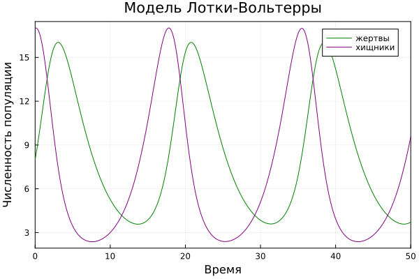
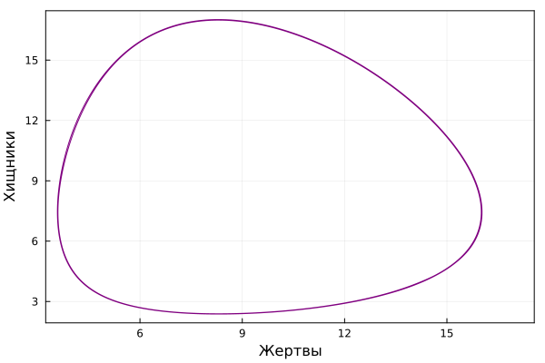
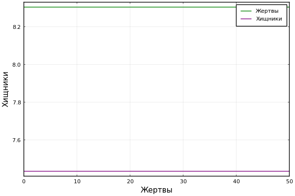
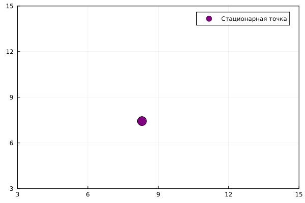
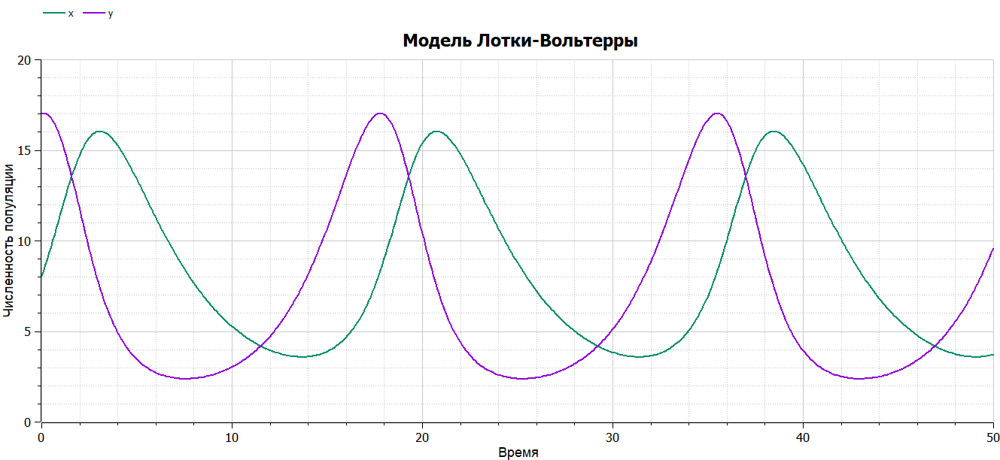
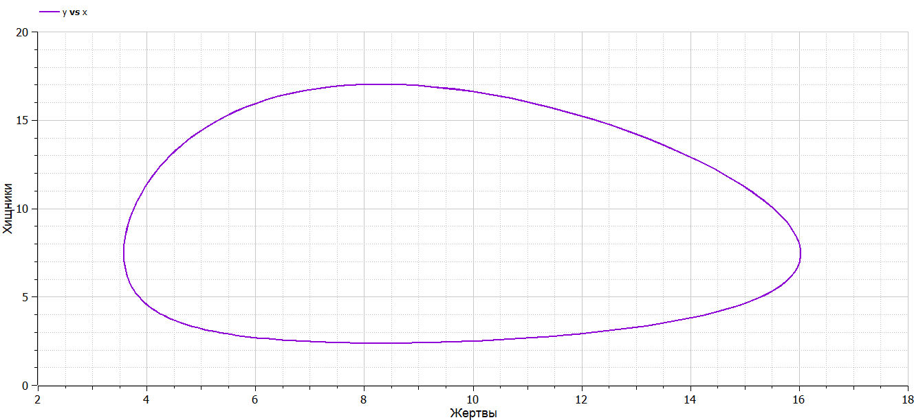
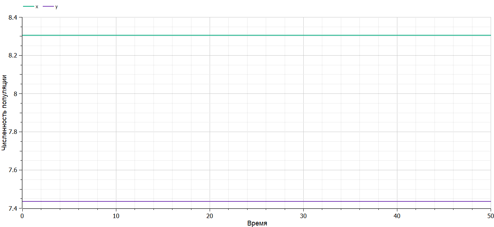

---
## Front matter
lang: ru-RU
title: Лабораторная работа №5
subtitle: Модель Лотки-Вольтерры
author:
  - Беличева Д. М.
institute:
  - Российский университет дружбы народов, Москва, Россия

## i18n babel
babel-lang: russian
babel-otherlangs: english

## Formatting pdf
toc: false
toc-title: Содержание
slide_level: 2
aspectratio: 169
section-titles: true
theme: metropolis
header-includes:
 - \metroset{progressbar=frametitle,sectionpage=progressbar,numbering=fraction}
 - '\makeatletter'
 - '\beamer@ignorenonframefalse'
 - '\makeatother'
---

# Информация

## Докладчик

:::::::::::::: {.columns align=center}
::: {.column width="70%"}

  * Беличева Дарья Михайловна
  * студентка
  * Российский университет дружбы народов
  * [1032216453@pfur.ru](mailto:1032216453@pfur.ru)
  * <https://dmbelicheva.github.io/ru/>

:::
::: {.column width="25%"}


:::
::::::::::::::

## Цель работы

Исследовать математическую модель Лотки-Вольерры.

## Задание

Для модели «хищник-жертва»:

$$\begin{cases}
    &\dfrac{dx}{dt} = - 0.29 x(t) + 0.039 x(t)y(t) \\
    &\dfrac{dy}{dt} = 0.49 y(t) - 0.059 x(t)y(t)
\end{cases}$$

Построить график зависимости численности хищников от численности жертв,
а также графики изменения численности хищников и численности жертв при
следующих начальных условиях:
$x_0 = 8, y_0 = 17.$ 
Найти стационарное состояние системы.

# Выполнение лабораторной работы

## Реализация на Julia  

```Julia
# Используемые библиотеки
using DifferentialEquations, Plots;
# задания системы ДУ, описывающей модель Лотки-Вольтерры
function LV(u, p, t)
    x, y = u
    a, b, c, d = p
    dx = a*x - b*x*y
    dy = -c*y + d*x*y
    return [dx, dy]
end
```

## Реализация на Julia 

```Julia
# Начальные условия
u0 = [8,17]
p = [-0.29, -0.039, -0.49, -0.059]
tspan = (0.0, 50.0)
prob = ODEProblem(LV, u0, tspan, p)
sol = solve(prob, Tsit5())
```

## Реализация на Julia 

{#fig:001 width=70%}

## Реализация на Julia 

{#fig:002 width=70%}

## Реализация на Julia 

$$\begin{cases}
  &x_0 = \dfrac{\gamma}{\delta}\\
  &y_0 = \dfrac{\alpha}{\beta}
\end{cases}
$$

Получим, что $x_0 = \dfrac{0.29}{0.039} = 8.305084745762713$, а $y_0 = \dfrac{0.49}{0.059}=7.435897435897435$

## Реализация на Julia 

{#fig:003 width=70%}

## Реализация на Julia 

{#fig:004 width=70%}

## Реализация на OpenModelica

```
model lab5_1
  parameter Real a = -0.29;
  parameter Real b = -0.039;
  parameter Real c = -0.49;
  parameter Real d = -0.059;
  parameter Real x0 = 8;
  parameter Real y0 = 17;
  Real x(start=x0);
  Real y(start=y0);
equation
    der(x) = a*x - b*x*y;
    der(y) = -c*y + d*x*y;
end lab5_1;
```

## Реализация на OpenModelica

{#fig:005 width=70%}

## Реализация на OpenModelica

{#fig:006 width=70%}

## Реализация на OpenModelica

{#fig:007 width=70%}

## Выводы

В результате выполнения лабораторной работы я построила математическую модель Лотки-Вольтерры на Julia и в OpenModelica.

# Список литературы

1. Модель Лотки — Вольтерры [Электронный ресурс]. URL: https://ru.wikipedia.org/wiki/Модель_Лотки_—_Вольтерры.