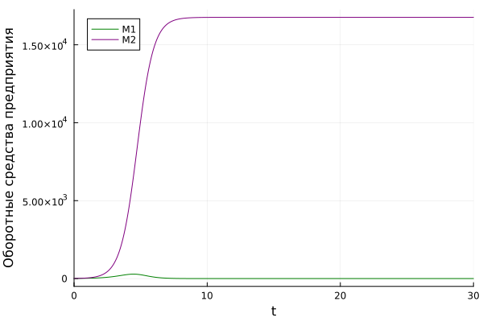

---
## Front matter
lang: ru-RU
title: Лабораторная работа №8
subtitle: Модель конкуренции двух фирм
author:
  - Беличева Д. М.
institute:
  - Российский университет дружбы народов, Москва, Россия

## i18n babel
babel-lang: russian
babel-otherlangs: english

## Formatting pdf
toc: false
toc-title: Содержание
slide_level: 2
aspectratio: 169
section-titles: true
theme: metropolis
header-includes:
 - \metroset{progressbar=frametitle,sectionpage=progressbar,numbering=fraction}
 - '\makeatletter'
 - '\beamer@ignorenonframefalse'
 - '\makeatother'
---

# Информация

## Докладчик

:::::::::::::: {.columns align=center}
::: {.column width="70%"}

  * Беличева Дарья Михайловна
  * студентка
  * Российский университет дружбы народов
  * [1032216453@pfur.ru](mailto:1032216453@pfur.ru)
  * <https://dmbelicheva.github.io/ru/>

:::
::: {.column width="25%"}


:::
::::::::::::::

# Вводная часть

## Цель работы

Исследовать математическую модель конкуренции двух фирм.

## Задача

*Случай 1* 

$$\begin{cases}                                 
  \dfrac{dM_1}{d\theta} = M_1-\dfrac{b}{c_1}M_1M_2-\dfrac{a_1}{c_1}M_1^2,\\
  \dfrac{dM_2}{d\theta} = \dfrac{c_2}{c_1}M2-\dfrac{b}{c_1}M_1M_2-\dfrac{a_1}{c_1}M_2^2,
\end{cases}
$$

где $a_1=\dfrac{p_{cr}}{\tau_{1}^2\tilde p_1^2Nq}, \, \, a_2=\dfrac{p_{cr}}{\tau_{2}^2\tilde p_2^2Nq}, \, \, b=\dfrac{p_{cr}}{\tau_{1}^2\tilde p_1^2\tau_{2}^2\tilde p_2^2Nq}, \, \, c_1=\dfrac{p_{cr} - \tilde{p_1}}{\tau_{1}\tilde p_1}, \, \, c_2=\dfrac{p_{cr} - \tilde{p_1}}{\tau_{2}\tilde p_2}$

Также введена нормировка $t=c_1\theta$.

## Задача

*Случай 2* 

$$\begin{cases}                                 
  \dfrac{dM_1}{d\theta} = M_1-(\dfrac{b}{c_1}+0.00015)M_1M_2-\dfrac{a_1}{c_1}M_1^2,\\
  \dfrac{dM_2}{d\theta} = \dfrac{c_2}{c_1}M2-\dfrac{b}{c_1}M_1M_2-\dfrac{a_1}{c_1}M_2^2,
\end{cases}
$$

## Задача

$$M_0^1=7.3, \, M_0^2=8.3,$$
$$p_{cr}=42, \,N=88, q=1$$
$$\tau_1=28, \, \tau_2=25,$$
$$\tilde{p_1}=13, \, \tilde{p_2}=10$$

## Задача

*Обозначения:*

* $N$ -- число потребителей производимого продукта.
* $\tau$ -- длительность производственного цикла
* $p$ -- рыночная цена товара
* $\tilde{p}$ -- себестоимость продукта, то есть переменные издержки на производство единицы
продукции.
* $q$ -- максимальная потребность одного человека в продукте в единицу времени
* $\theta = \dfrac{t}{c_1}$ -- безразмерное время

## Задание

1. Построить графики изменения оборотных средств фирмы 1 и фирмы 2 без
учета постоянных издержек и с веденной нормировкой для случая 1.
2. Построить графики изменения оборотных средств фирмы 1 и фирмы 2 без
учета постоянных издержек и с веденной нормировкой для случая 2.

# Выполнение лабораторной работы

## Реализация на Julia

Для реализации на языке программирования Julia будем использовать библиотеки `DifferentialEquations.jl` для решения дифференциальных уравнений и `Plots.jl` для отрисовки графиков.

## Реализация на Julia

```Julia
p_cr = 42 #критическая стоимость продукта
tau1 = 28 #длительность производственного цикла фирмы 1
p1 = 13 #себестоимость продукта у фирмы 1
tau2 = 25 #длительность производственного цикла фирмы 2
p2 = 10 #себестоимость продукта у фирмы 2
N = 88 #число потребителей производимого продукта
q = 1; #максимальная потребность одного человека в продукте в единицу времени
```

## Реализация на Julia

```Julia
a1 = p_cr/(tau1^2*p1^2*N*q);
a2 = p_cr/(tau2^2*p2^2*N*q);
b = p_cr/(tau1^2*tau2^2*p1^2*p2^2*N*q);
c1 = (p_cr-p1)/(tau1*p1);
c2 = (p_cr-p2)/(tau2*p2);

u0 = [7.3, 8.3] #начальные значения M1 и M2
p = [a1, a2, b, c1, c2]
tspan = (0.0, 30.0) #временной интервал
```

## Реализация на Julia. Случай 1

```Julia
function f(u, p, t)
    M1, M2 = u
    a1, a2, b, c1, c2 = p
    M1 = M1 - (a1/c1)*M1^2 - (b/c1)*M1*M2
    M2 = (c2/c1)*M2 - (a2/c1)*M2^2 - (b/c1)*M1*M2
    return [M1, M2]
end
```

## Реализация на Julia. Случай 1

```Julia
prob = ODEProblem(f, u0, tspan, p)
sol = solve(prob, Tsit5(), saveat = 0.01)
plot(sol, yaxis = "Оборотные средства предприятия", label = ["M1" "M2"], 
        c = ["green" "purple"])
```

## Реализация на Julia. Случай 1

{#fig:001 width=70%}

## Реализация на Julia. Случай 2

```Julia
function f(u, p, t)
    M1, M2 = u
    a1, a2, b, c1, c2 = p
    M1 = M1 - (a1/c1)*M1^2 - (b/c1+0.00015)*M1*M2
    M2 = (c2/c1)*M2 - (a2/c1)*M2^2 - (b/c1)*M1*M2
    return [M1, M2]
end
```

## Реализация на Julia. Случай 2

```Julia
prob = ODEProblem(f, u0, tspan, p)
sol = solve(prob, Tsit5(), saveat = 0.01)
plot(sol, yaxis = "Оборотные средства предприятия", label = ["M1" "M2"], 
          c = ["green" "purple"])
```

## Реализация на Julia. Случай 2

{#fig:002 width=70%}

## Реализация на Julia. Случай 2.

{#fig:003 width=70%}

## Реализация на OpenModelica. Случай 1

```
  parameter Real p_cr = 42;
  parameter Real tau1 = 28;  
  parameter Real p1 = 13;
  parameter Real tau2 = 25;
  parameter Real p2 = 10;  
  parameter Real N = 88;
  parameter Real q = 1;
  parameter Real a1 = p_cr/(tau1^2*p1^2*N*q);
  parameter Real a2 = p_cr/(tau2^2*p2^2*N*q);
  parameter Real b = p_cr/(tau1^2*tau2^2*p1^2*p2^2*N*q);  
  parameter Real c1 = (p_cr-p1)/(tau1*p1);
  parameter Real c2 = (p_cr-p2)/(tau2*p2); 
  Real M1(start=7.3);
  Real M2(start=8.3);
```

## Реализация на OpenModelica. Случай 1

```
equation
  der(M1) = M1 - (a1/c1)*M1^2 - (b/c1)*M1*M2;
  der(M2) = (c2/c1)*M2 - (a2/c1)*M2^2 - (b/c1)*M1*M2;
```

## Реализация на OpenModelica. Случай 1

{#fig:004 width=70%}

## Реализация на OpenModelica. Случай 2

```
  parameter Real p_cr = 42;
  parameter Real tau1 = 28;  
  parameter Real p1 = 13;
  parameter Real tau2 = 25;
  parameter Real p2 = 10;  
  parameter Real N = 88;
  parameter Real q = 1;
  parameter Real a1 = p_cr/(tau1^2*p1^2*N*q);
  parameter Real a2 = p_cr/(tau2^2*p2^2*N*q);
  parameter Real b = p_cr/(tau1^2*tau2^2*p1^2*p2^2*N*q);  
  parameter Real c1 = (p_cr-p1)/(tau1*p1);
  parameter Real c2 = (p_cr-p2)/(tau2*p2);
  Real M1(start=7.3);
  Real M2(start=8.3);
```

## Реализация на OpenModelica. Случай 2  

```
equation
  der(M1) = M1 - (a1/c1)*M1^2 - (b/c1+0.00015)*M1*M2;
  der(M2) = (c2/c1)*M2 - (a2/c1)*M2^2 - (b/c1)*M1*M2;
```

## Реализация на OpenModelica. Случай 2

{#fig:005 width=70%}

## Реализация на OpenModelica. Случай 2

{#fig:006 width=70%}

# Выводы

В результате выполнения лабораторной работы была исследована модель конкуренции двух фирм.

## Список литературы

1. Копылов А.В., Просвиров А.Э. ДИНАМИЧЕСКАЯ МОДЕЛЬ КОНКУРЕНЦИИ ДВУХ ФИРМ НА ОДНОРОДНОМ РЫНКЕ. 2003. 29-32 с.
