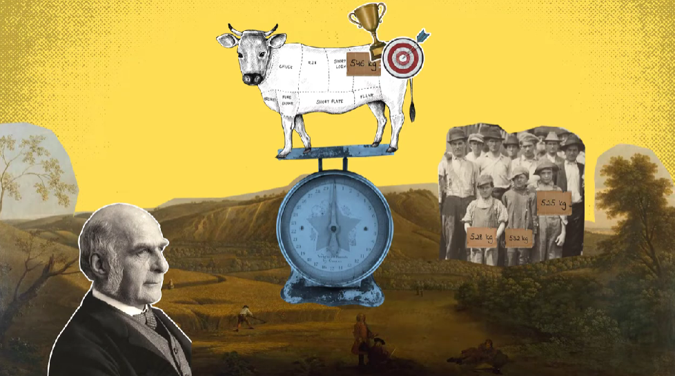

---
## Front matter
lang: ru-RU
title: Доклад
subtitle: Теорема о прогнозе разнообразия
author:
  - Беличева Д. М.
institute:
  - Преподаватель - Кулябов Д. С.
  - Российский университет дружбы народов, Москва, Россия
date: 01 января 1970

## i18n babel
babel-lang: russian
babel-otherlangs: english

## Formatting pdf
toc: false
toc-title: Содержание
slide_level: 2
aspectratio: 169
section-titles: true
theme: metropolis
header-includes:
 - \metroset{progressbar=frametitle,sectionpage=progressbar,numbering=fraction}
 - '\makeatletter'
 - '\beamer@ignorenonframefalse'
 - '\makeatother'
---

# Информация

## Докладчик

:::::::::::::: {.columns align=center}
::: {.column width="70%"}

  * Беличева Дарья Михайловна
  * студентка
  * Российский университет дружбы народов
  * [1032216453@pfur.ru](mailto:1032216453@pfur.ru)
  * <https://dmbelicheva.github.io/ru/>

:::
::: {.column width="25%"}


:::
::::::::::::::

# Вводная часть

## Эпиграф

> "Трудно делать прогнозы, особенно насчет будущего.“  
>$\qquad\qquad\qquad\qquad\qquad$ <cite>Йоги Берра</cite>

## Цели и задачи

**Цель**

Исследовать теорему о прогнозе разнообразия.

**Задачи**

* Описать понятие "мудрость толпы";

* Дать теоретическое описание теоремы о прогнозе разнообразия;

* Привести пример, показывающий работу теоремы;

* Показать практическую реализацию расчетов по теореме о прогнозе разнообразия на языке программирования Julia. 

## Актуальность

Теорема о прогнозе разнообразия применима к моделям, которые делают численные прогнозы или оценки. Она количественно оценивает
влияние точности моделей и их разнообразия на точность их среднего.

# Эксперимент Гальтона

{#fig:001 width=70%}

## Эксперимент Гальтона

> "Результат кажется более достойным доверия к демократическому суждению, чем можно было ожидать."
> 
> Френсис Гальтон

# Мудрость толпы

Мудрость толпы - это коллективное мнение группы людей, а не одного эксперта.

## Мудрость толпы

: Пять элементов, необходимых для формирования мудрой толпы

|Критерии	                       |   Описание                                                                                                           |
|--------------------------------|----------------------------------------------------------------------------------------------------------------------|
|Разнообразие мнений             |  У каждого человека должна быть личная информация, даже если это просто эксцентричная интерпретация известных фактов.|
|Независимость                   |  Мнения людей не определяются мнениями окружающих.                                                                   |
|Децентрализация	               |  Люди могут специализироваться и использовать местные знания.                                                        |
|Агрегация	                     |  Существует некоторый механизм для превращения частных суждений в коллективное решение.                              |
|Доверие	                       |  Каждый человек верит, что коллективная группа справедлива.                                                          |

# Теорема о прогнозе разнообразия

Коллективная ошибка = Средняя индивидуальная ошибка - Разнообразие прогнозирования

$$(c - \theta)^2 = \frac{1}{n} \sum_{i = 1}^n (s_i - \theta)^2 - \frac{1}{n} \sum_{i = 1}^n (s_i - c)^2$$

* $c$ — предсказание толпы (общая оценка параметра).
* $\theta$ — истинное значение параметра.
* $s_i$ — индивидуальные оценки параметра.

# Пример работы теоремы

Три человека предсказывают, сколько посетителей придет в закусочную на обед в определенный день. 
Реальное число людей, пришедших на обед:

$$\mathrm{true} \, \, \, \mathrm{value} = 18$$

## Пример работы теоремы

: Результаты предсказаний людей

|Человек | Предсказание |
|--------|--------------|
|Катя    |      10      |
|Костя   |      16      |
|Мариян  |      25      |

$$\mathrm{average} \, \, \, \mathrm{value} = \dfrac{10+16+25}{3} = 17$$ 

## Пример работы теоремы

: Квадратичная ошибка каждого человека

|Человек | Ошибка         |
|--------|----------------|
|Катя    |$(18-10)^2= 64$ |
|Костя   |$(18-16)^2= 4$  |
|Мариян  |$(18-25)^2= 49$ |

$$\mathrm{average} \, \, \, \mathrm{error} = \dfrac{64+4+49}{3} = 39$$

## Пример работы теоремы

$$\mathrm{crowd's} \, \, \, \mathrm{error} = (18-17)^2 = 1$$

## Пример работы теоремы

: Отдаленность предсказания каждого человека от среднего прогноза

|Человек | Разнообразие   |
|--------|----------------|
|Катя    |$(17-10)^2= 49$ |
|Костя   |$(17-16)^2= 1$  |
|Мариян  |$(17-25)^2= 64$ |
 
$$\mathrm{diversity} = \dfrac{49+1+64}{3} = 38$$

## Пример работы теоремы

$$1 = 39 - 38,$$

то есть

$$\mathrm{Crowd's} \, \, \, \mathrm{error} = \mathrm{Average} \, \, \, \mathrm{error} - \mathrm{Diversity}$$

Таким образом, мы пришли к теореме о прогнозе разнообразия (Diversity Prediction Theorem):

$$(c - \theta)^2 = \frac{1}{n} \sum_{i = 1}^n (s_i - \theta)^2 - \frac{1}{n} \sum_{i = 1}^n (s_i - c)^2$$

# Практическая реализация

## Используемые библиотеки

```Julia
import Statistics: mean
```

## Функция diversitytheorem

```Julia
function diversitytheorem(truth::T, pred::Vector{T}) where T<:Number
    μ = mean(pred)
    avgerr = mean((pred .- truth) .^ 2)
    crderr = (μ - truth) ^ 2
    divers = mean((pred .- μ) .^ 2)
    avgerr, crderr, divers
end
for (t, s) in [(18, [10, 16, 25])]
    avgerr, crderr, divers = diversitytheorem(t, s)
    println("""
    average-error : $avgerr
    crowd-error   : $crderr
    diversity     : $divers
    """)
end
```

## Результат выполнения функции

```
average-error : 39.0
crowd-error   : 1.0
diversity     : 38.0
```

# Выводы

Была исследована теорема о прогнозе разнообразия.

# Список литературы

1. Пейдж С. Модельное мышление. Как анализировать сложные явления с помощью математических моделей. 2015. 528 с.

2. The Wisdom of Crowds [Электронный ресурс]. URL: https://en.wikipedia.org/wiki/The_Wisdom_of_Crowds#cite_note-1.

3. Surowiecki J. The Wisdom of Crowds. Doubleday, Anchor, 2004. 336 с.