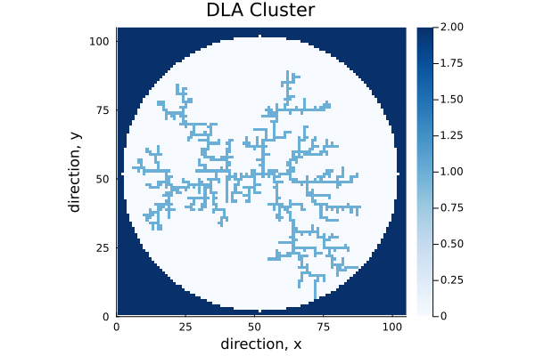
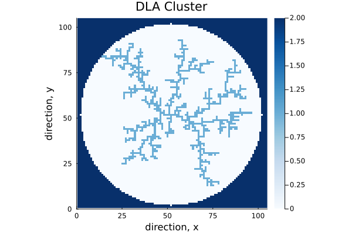

---
## Front matter
lang: ru-RU
title: Этап 3
subtitle: Программная реализация проекта "Неравновесная агрегация, фракталы"
author:
  - Беличева Д. М.,
  - Демидова Е. А.,
  - Смирнов-Мальцев Е. Д.,
  - Сунгурова М. М.
institute:
  - Российский университет дружбы народов, Москва, Россия
date: 14 марта 2024

## i18n babel
babel-lang: russian
babel-otherlangs: english

## Formatting pdf
toc: false
toc-title: Содержание
slide_level: 2
aspectratio: 169
section-titles: true
theme: metropolis
header-includes:
 - \metroset{progressbar=frametitle,sectionpage=progressbar,numbering=fraction}
 - '\makeatletter'
 - '\beamer@ignorenonframefalse'
 - '\makeatother'
---

# Информация

## Состав исследовательской команды

Студенты группы НКНбд-01-21:

- Беличева Дарья Михайловна
- Демидова Екатерина Алексеевна
- Сунгурова Мариян Мухсиновна
- Смирнов-Мальцев Егор Дмитриевич

# Вводная часть

## Цель работы

Реализовать алгоритм моделирования агрегации, ограниченной диффузией(DLA) на языке программирования Julia.

## Задачи

- Описать функции для построения кластера;
- Построить график модели кластера DLA. 

# Программная реализация

## Используемые библиотеки

```Julia
using Plots
using Random
using ColorSchemes
```

## Функция генерации случайной точки на заданном радиусе

```Julia
function randomAtRadius(radius, seedX, seedY)
    theta = 2*pi*rand() #generate random theta
    x=trunc(Int, radius*cos(theta))+seedX #use trig to transfer into X
    y=trunc(Int, radius*sin(theta))+seedY #find Y coordinate
    location=[x, y] #save locaction
    return location
end
```

## Функция проверки местонахождения частицы

```Julia
function checkAround(location,squareSize,matrix)
	foundFriend = false #found another particle
	exitCircle = false #reached the required radius
	nearEdge=false #near the edge of the field

...

  		return location, foundFriend, nearEdge, exitCircle
end	
```

## Инициализация переменных

```Julia
radius = 50
seedX = radius+2
seedY = radius+2
squareSize = radius*2+5
completeCluster = false
randomWalkersCount = 0
```

## Функция для отрисовки кластера

```Julia
heatmap(matrix, title="DLA Cluster", xlabel = "direction, x", 
    ylabel = "direction, y"; seriescolor = cgrad(ColorSchemes.Blues, ), 
          aspect_ratio = :equal, xlims = (0,105), ylims = (0, 105))
```

## График модели кластера DLA

{#fig:007 width=70%}

## График модели кластера DLA

{#fig:007 width=70%}

# Заключение

## Выводы

Был реализован алгоритм моделирования агрегации, ограниченной диффузией на языке программирования Julia.

## Список литературы

1. “Julia GitHub.” (2023), [Online]. Available:https://github.com/JuliaLang/julia.

2. Энгхейм Э. JULIA в качестве второго языка. ДМК Пресс, 2023.